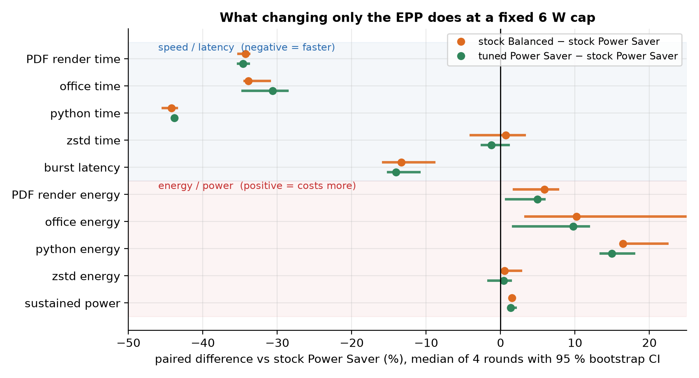
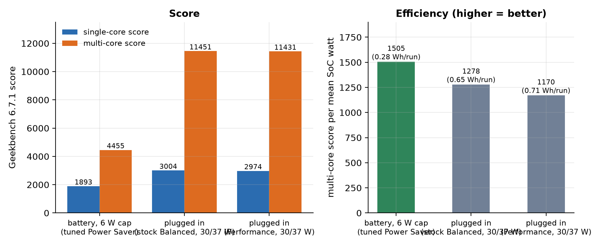
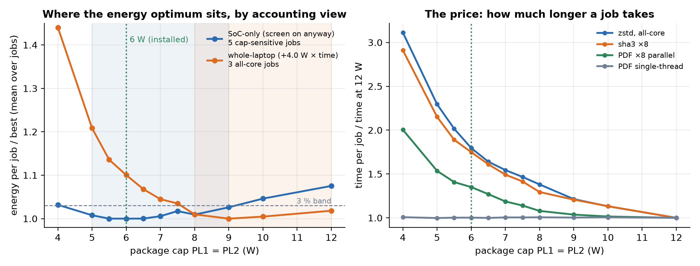

# Finding the power inflection point of a Lunar Lake laptop on Linux

**HP OmniBook X Flip 16 (16-as0xxx) · Intel Core Ultra 9 288V · Ubuntu 26.04 · kernel 7.0.0-31 · 2880×1800 120 Hz OLED · BIOS F.10**

Aim: find the package power cap at which this chip does the most work per joule, install it as a manual
*battery* profile, and compare it with the stock Balanced and Performance profiles on the same tasks with the
same telemetry. Everything is measured, scripted and reproducible; the raw 2 Hz power samples of every run are
in `results/`. Companion repo (same laptop): [touchscreen IRQ-routing fix](https://github.com/testyfishy/hp-omnibook-flip16-touchscreen-fix).

## Result

| | battery (installed) | plugged in | Performance |
|---|---|---|---|
| power-profiles-daemon profile | power-saver | balanced | performance (manual) |
| package cap PL1 / PL2 | **6 W / 6 W** | 30 / 37 W | 30 / 37 W |
| CPU energy-performance preference (EPP) | **balance_power** (overridden) | balance_performance | performance |
| iGPU ceiling · panel refresh | 1500 MHz · 48 Hz | 2050 MHz · 120 Hz | 2050 MHz · 120 Hz |

* **6 W is where all-core work costs the fewest joules** (149 J/GB vs 174 at 4 W and 181 at stock); the
  re-test puts the optimum on a plateau from 5.5 to 6.5 W.
* **The cap does not touch ordinary use.** Single-thread tasks take the same time and energy from 4 W to 12 W.
* **The EPP is what makes a capped laptop feel slow.** Changing it from `power` to `balance_power` at the same
  6 W made single-thread tasks 30–44 % faster and bursts 14 % lower-latency for +1.7 % SoC energy.
* **Geekbench 6 at the policy: 1893 / 4455** vs 3004 / 11451 plugged in, for 57 % less energy per run.
  Performance mode is identical to Balanced on this machine.
* One caveat: if the laptop is on *only* to run a batch job, the optimum is 8–10 W (section 6).


Implementation: `scripts/power-switch.sh` + `power-switch.conf` (udev rule on the adapter, boot service, sleep
hook; installer `step13-power.sh`, EPP + cap step `step58-power-final.sh`, rollback included).

## Method

### Names

| name | profile | EPP | HP thermal mode | raw label |
|---|---|---|---|---|
| **stock Power Saver** | power-saver | `power` | quiet | `saver` |
| **stock Balanced** | balanced | `balance_performance` | balanced | `balanced` |
| **tuned Power Saver** (installed) | power-saver | `balance_power` | quiet | `saver+bp` |

EPP tells the hardware how eagerly to raise clocks inside its power budget (`power` least, `performance`
most). Caps are PL1/PL2 in watts (sustained / burst); all caps here use PL1 = PL2, so there is no burst budget.

### Measurement

| item | choice | why |
|---|---|---|
| energy | RAPL package / core / uncore counters, 2 Hz, fork-free bash sampler | ~0.99 correlation with wall power, <2 % overhead (Khan 2018) |
| whole laptop | BAT0 `energy_now` over whole runs (36 J steps); `power_now` ignored | `power_now` is EC-smoothed over tens of seconds (flat 6.5 W under any load) |
| also logged | package temp, fan rpm, mean + peak core MHz, iGPU MHz, battery V | fan/thermal cost visible |
| phases | markers per tier/phase; only intervals fully inside a phase count; rests excluded | no boundary mixing |
| metric | energy-to-completion for fixed work (J per job), throughput for sustained runs | the quantity the cap actually trades |
| order | caps ascending with a thermal gate (ref +3 °C) before each; profiles interleaved over all 6 permutations | thermal carry-over and drift cancel |
| stats | median + IQR; paired per-round differences with 10 000-sample bootstrap 95 % CI | a difference counts only if the CI excludes 0 |
| controls | blanking/suspend inhibited; brightness, Wi-Fi, background, panel refresh held; cap re-applied and read back after every profile switch | HP firmware pins one PL1 register at 12 W on battery; ppd writes EPP only on a profile *change* |

### Workloads

| job | what | type |
|---|---|---|
| pdf_render | 40 pages, pdftoppm 110 dpi | single-thread, real |
| office | LibreOffice docx → pdf | single-thread, real |
| python | 300 k-record JSON / regex / sort | single-thread, interpreter |
| compress | 250 MB `zstd -T0 -12` | all-core, integer |
| sustained | zstd loop, 20–40 s | all-core, throughput |
| bursty | 20 × fixed single-thread burst every 0.5 s | interactive latency (racing vs pacing to idle) |
| re-test additions | sha3-256 ×8 threads, PDF ×8 parallel, sha3-256 1 GB single | vector, real parallel, Geekbench-like single |

## Results

### 0 · Idle: what the SoC costs before any cap matters


| scenario (battery, screen on, hands off) | SoC W | pkg C10 % | IRQ/s |
|---|---|---|---|
| Firefox + chat app open, 120 Hz | 1.68 | 0 | 10 800 |
| + panel 48 Hz | 1.38 | 0.2 | 6 900 |
| + Firefox frozen (animated tab) | 1.02 | 3.4 | 2 200 |
| everything quiet | **0.51–0.55** | **59–60** | 700–950 |

Suspend (s2idle, 5.5 h overnight): 0.62 W ≈ 0.95 % per hour. Deep package idle is reachable with the screen
on; a rendering browser tab costs more than any cap saves. `results/00-idle-baseline/`.

### 1 · Cap ladder, plugged in (Balanced) — locating the region

`results/01-ac-ladder/`, PL1 = PL2, 4-task set, best of 2.

| cap | task-set s | task-set J | time | energy | | cap | task-set s | task-set J | time | energy |
|---|---|---|---|---|---|---|---|---|---|---|
| 30/37 | 10.0 | 178 | 1.00× | 1.00× | | 9 | 13.7 | 124 | 1.37× | 0.70× |
| 20 | 10.4 | 152 | 1.04× | 0.86× | | **8** | 13.9 | **112** | 1.39× | **0.63×** |
| 15 | 11.2 | 143 | 1.12× | 0.80× | | 7 | 16.9 | 119 | 1.69× | 0.67× |
| 12 | 11.7 | 135 | 1.17× | 0.76× | | 6 | 20.2 | 123 | 2.02× | 0.69× |
| 10 | 12.8 | 128 | 1.28× | 0.72× | | 5 | 25.0 | 128 | 2.50× | 0.72× |

Energy falls to 8 W and turns back up below 7 W: the region of interest is 5–8 W.

### 2 · Cap ladder, on battery (Power Saver, EPP power) — the inflection point

`results/02-battery-ladder/`: 13 tiers ascending, cool-down gate, 15 s idle + 4 tasks ×2 + 40 s sustained each.
Fan 0 rpm, 39–55 °C. Raw trace: `ladder2-20260918-2258.png`.


| PL1/PL2 | sustained MB/s | sustained W | **J/GB** | short-set s | short-set J | zstd s | battery W | rest W |
|---|---|---|---|---|---|---|---|---|
| 4/4 | 23.5 | 3.99 | 174 | 30.8 | 83 | 10.5 | 5.85 | 3.52 |
| 5/5 | 31.3 | 4.97 | 163 | 28.0 | 79 | 7.7 | 6.17 | 3.61 |
| **6/6** | 40.4 | 5.90 | **149** | 26.6 | 76 | 6.2 | 6.61 | 3.72 |
| 4/8 | 30.2 | 4.89 | 166 | 24.8 | 76 | 4.5 | 6.36 | 3.74 |
| 6/8 | 50.3 | 7.40 | 151 | 24.9 | 78 | 4.8 | 7.40 | 3.97 |
| 8/8 | 52.3 | 7.80 | 153 | 25.1 | 77 | 4.7 | 7.49 | 3.98 |
| **8/8 @ balance_power** | 53.5 | 7.95 | 152 | **17.7** | 78 | 4.6 | 8.11 | 4.19 |
| 10/10 | 61.4 | 9.47 | 158 | 24.2 | 79 | 4.1 | 8.19 | 4.18 |
| 12/12 | 65.1 | 10.99 | 173 | 23.8 | 82 | 3.9 | 8.63 | 4.11 |
| stock 12/21 | 66.7 | 11.81 | 181 | 24.0 | 84 | 3.8 | 8.94 | 4.19 |

* J/GB bottoms at 6 W; a separate burst budget (x/8) buys nothing over PL1 = PL2.
* The short set is flat from 4 W up except the all-core zstd task (pdf 15 s, office 2.4 s, python 2.6 s at
  every cap) — until the EPP changes: the 8/8 balance_power row runs the same set in 17.7 s for the same energy.
  That row became experiment 3.
* "rest W" (panel, RAM, Wi-Fi) is 3.5–4.2 W whatever the cap. Full per-phase statistics: `ladder2-…summary.txt`.

### 3 · Profile comparison at a fixed 6 W cap (interleaved A/B/C)

`results/03-profile-ab/`: 6 rounds × 3 conditions, 48 Hz frozen, 10 s idle + 20 bursts + 4 tasks + 20 s sustained
per trial. Rounds 2–3 of stock Power Saver were contaminated (daemon saw "no profile change" and left
`balance_power` in place; two fast outliers in `summary.txt`); the clean rounds 1, 4, 5, 6 are used
(`summary-clean-rounds-1-4-5-6.txt`); the runner now sets EPP explicitly.



| median of 4 rounds | stock Power Saver | stock Balanced | tuned Power Saver |
|---|---|---|---|
| burst latency median / p95 (ms) | 134 / 141 | 116 / 119 | 116 / 118 |
| pdf · office · python · zstd time (s) | 15.0 · 2.46 · 2.65 · 6.18 | 9.85 · 1.64 · 1.48 · 6.21 | 9.80 · 1.69 · 1.49 · 6.13 |
| pdf · office · python · zstd energy (J) | 27.3 · 5.85 · 6.70 · 36.8 | 28.5 · 6.15 · 7.80 · 37.1 | 28.5 · 6.25 · 7.75 · 36.8 |
| sustained MB/s · W · J/GB | 40.1 · 5.90 · 150.5 | 40.7 · 5.98 · 150.4 | 40.4 · 5.97 · 151.1 |
| whole-trial SoC Wh · idle W · Tmax | 0.071 · 0.500 · 44.5 °C | 0.072 · 0.523 · 48 °C | 0.072 · 0.502 · 48 °C |

* Both alternatives: single-thread tasks −30…−44 %, burst latency −14…−16 %, in 4/4 rounds (CIs exclude 0).
* Cost: +5…+16 % J on the short tasks, +1.5 % sustained W, +1.7 % (tuned) / +2.9 % (Balanced) SoC Wh per
  trial; idle unchanged.
* Tuned Power Saver = Balanced's speed at lower energy with the quiet fan mode → installed.

### 4 · Stress verification of the installed policy

`results/04-stress-verify/`: idle → single-thread → all-core zstd −19 → openssl ×8 → openssl ×8 + iGPU → idle.


| phase | SoC W mean / median / p99 / max | pkg T |
|---|---|---|
| idle · recovery | 0.50 / 0.42 / – / 1.34 · 0.53 / 0.44 / – / 1.28 | 32 · 42 °C |
| single-thread (peak core 3100 MHz) | 4.35 / 4.29 / – / 5.19 | 44 °C |
| all-core zstd −19, 90 s | 5.93 / 5.96 / 6.91 / 7.19 | 43 °C |
| all-core openssl ×8 | 5.93 / 5.97 / 6.14 / 7.46 | 47 °C |
| openssl ×8 + iGPU (iGPU held at 400 MHz floor) | 5.97 / 5.97 / 6.03 / 6.43 | 48 °C |

Fan 0 rpm, 0 thermal-throttle events, EPP and caps unchanged at the end. The PL1 window is 28 s and PL2's ~1 ms,
so PL1 = PL2 makes the cap effectively instantaneous. CPU+GPU-heavy use (games) will crawl at 6 W by design.

### 5 · Geekbench 6 across the three configurations

`results/05-geekbench/` (public result pages; scores read from headless-browser screenshots, `*.scores.txt`).



| configuration | single | multi | run s | SoC W mean / max | Wh / run | multi per W | Tmax · fan | result |
|---|---|---|---|---|---|---|---|---|
| **battery, tuned Power Saver, 6 W** | **1893** | **4455** | 344 | 2.96 / 7.9 | **0.283** | **1504** | 51 °C · 0 | [19213634](https://browser.geekbench.com/v6/cpu/19213634) |
| same, repeat | 1835 | 4434 | 346 | 3.09 / – | 0.297 | 1435 | – | [19213540](https://browser.geekbench.com/v6/cpu/19213540) |
| plugged in, stock Balanced, 30/37 W | 3004 | 11451 | 262 | 8.96 / 37.0 | 0.652 | 1277 | 95 °C · 2550 | [19213676](https://browser.geekbench.com/v6/cpu/19213676) |
| plugged in, Performance, 30/37 W | 2974 | 11431 | 262 | 9.77 / 37.1 | 0.711 | 1170 | 94 °C · 2350 | [19213724](https://browser.geekbench.com/v6/cpu/19213724) |

* Capped: −37 % single, −61 % multi, −57 % energy per run, best score per watt. Geekbench's single-core tests
  pull one core above 6 W, unlike the light daily tasks, so the cap shows here where it did not in section 2.
* Performance = Balanced (same caps); it only adds fan and 9 % energy. Repeatability within 3 %.

### 6 · Robust inflection-point re-test — 6 W confirmed for the intended use

`results/06-inflection/`: 11 caps (4…12 W, 0.5 W steps around 6), 3 passes (ascending / descending /
shuffled), EPP `balance_power`, thermal gate + 10 s idle per cap, 6 fixed-work jobs. 41 min, fan 0 rpm, every
cap started at 39 °C, pass-to-pass spread 1–3 %. Rest-of-system over the run: 4.00 W.



SoC J per job (median of 3) · time per job (s):

| cap W | zstd ×8 | sha3 ×8 | PDF ×8 | PDF single | python | sha3 single |
|---|---|---|---|---|---|---|
| 4 | 85.2 · 21.3 | 21.1 · 5.1 | 27.3 · 6.8 | 27.9 · 9.9 | 13.7 · 3.4 | 19.2 · 4.9 |
| 5 | 78.3 · 15.7 | 19.4 · 3.8 | **26.1** · 5.2 | 28.2 · 9.8 | 14.9 · 3.0 | 19.6 · 4.7 |
| 5.5 | 75.6 · 13.8 | 18.8 · 3.3 | 26.4 · 4.8 | 28.1 · 9.8 | 15.0 · 2.9 | 19.8 · 4.8 |
| **6** | 73.3 · 12.3 | 18.8 · 3.1 | 27.5 · 4.6 | 28.4 · 9.8 | 15.0 · 2.9 | 19.6 · 4.7 |
| 6.5 | **72.6** · 11.2 | 18.8 · 2.9 | 27.9 · 4.3 | 28.5 · 9.8 | 15.0 · 3.0 | 19.5 · 4.8 |
| 7 | 73.5 · 10.6 | 18.8 · 2.6 | 28.0 · 4.0 | 28.4 · 9.9 | 15.1 · 2.9 | 19.6 · 4.8 |
| 8 | 74.8 · 9.4 | **18.4** · 2.3 | 29.0 · 3.6 | 28.7 · 9.9 | 15.1 · 2.9 | 19.3 · 4.7 |
| 9 | 73.9 · 8.3 | 19.1 · 2.1 | 30.4 · 3.5 | 28.0 · 9.8 | 15.0 · 2.9 | 19.6 · 4.8 |
| 10 | 75.7 · 7.7 | 19.5 · 2.0 | 31.9 · 3.4 | 28.2 · 9.9 | 15.0 · 2.9 | 19.6 · 4.7 |
| 12 | 80.2 · 6.8 | 20.7 · 1.8 | 32.9 · 3.4 | 28.4 · 9.8 | 15.1 · 2.9 | 19.2 · 4.8 |

Aggregate (mean of each cap-sensitive job's J normalised to its own minimum; "lowest acceptable" = lowest cap
within 3 % of the best):

| view | 4 | 5 | 5.5 | **6** | 6.5 | 7 | 7.5 | 8 | 9 | 10 | 12 | best | ≤ 3 % | lowest ok |
|---|---|---|---|---|---|---|---|---|---|---|---|---|---|---|
| SoC-only (screen on anyway) | 1.073 | 1.048 | 1.040 | **1.040** | 1.040 | 1.046 | 1.058 | 1.050 | 1.067 | 1.088 | 1.118 | 5.5 W | 5–9 W | 5 W |
| whole-laptop (+4.0 W × time) | 1.455 | 1.221 | 1.147 | 1.112 | 1.079 | 1.056 | 1.046 | 1.020 | 1.010 | 1.015 | 1.029 | 9 W | 8–12 W | 8 W |

* Single-thread jobs are cap-insensitive from 4 to 12 W (one core under `balance_power` needs < 4 W).
* All-core jobs: SoC-only optimum is a plateau 5.5–6.5 W with 6 W on its floor; the jobs disagree by ±1.5 W.
* If the laptop is on only for the job, 8–10 W wins (6 W costs +10 % whole-laptop energy per all-core job)
  and the job runs 1.6× faster. Intended use here is screen-on work with occasional heavy background jobs →
  **6 W stays**; batch-then-sleep users should set 8 W (`CAP=8/8 step58-power-final.sh`).

## Reproducing

Bash + Python 3 (Pillow for charts; matplotlib for `make-figures.py`); root for RAPL counters and caps;
Ubuntu 26.04 with power-profiles-daemon 0.30 and intel_pstate active. Adapt RAPL/hwmon paths elsewhere.

```
sudo bash scripts/step14c-ladder-battery.sh      # cap ladder (~35 min);  TIERS_OVERRIDE="3/3 4/4 …"
sudo bash scripts/step14d-epp-ab.sh              # profile A/B/C at a fixed cap (~25 min);  CAP=6/6 ROUNDS=6
sudo bash scripts/step59-stress-verify.sh        # stress + PASS/FAIL of the installed policy (~6 min)
sudo bash scripts/step60-geekbench.sh            # Geekbench battery → AC → Performance (needs bench/Geekbench-6.7.1-Linux)
sudo bash scripts/step61-inflection.sh           # robust inflection re-test (~45 min);  CAPS="5 6 7" PASSES=2
python3 scripts/ladder-analyze.py results/02-battery-ladder/ladder2-20260918-2258      # re-analyse any run
python3 scripts/ab-analyze.py results/03-profile-ab/ab-20260918-2356
python3 scripts/inflection-analyze.py results/06-inflection/inflection-20260919-0634
python3 scripts/make-figures.py                  # regenerate results/figures/
```

`PDF=/path/to/some.pdf` gives the render jobs a real document (the published runs used a 4.4 MB, 40-page
journal PDF; the fallback is a generated, lighter one). Install the policy: `step13-power.sh` then
`step58-power-final.sh`; rollbacks included. Choosing a profile by hand in GNOME lets the daemon rewrite the
EPP until the next adapter event, boot or resume.

## Caveats

* One laptop, one firmware. The HP firmware pins one PL1 register at 12 W on battery; caps were verified via
  the MSR interface and, decisively, via measured power.
* The optimum is a 5.5–6.5 W plateau for these all-core workloads; a very different sustained load could move
  it by a watt. Single-thread work is insensitive either way.
* Battery `power_now` is unusable below a minute on this EC; whole-laptop figures come from `energy_now` over
  ≥ 2-minute windows (36 J quantisation).
* No Cinebench (no Linux build). Geekbench's free CLI prints no scores; they were read from the public pages.

## References

* Khan, Hirki, Niemi, Nurminen, Ou, *RAPL in Action*, ACM TOMPECS 3(2), 2018. https://doi.org/10.1145/3177754
* Hoffmann et al., *Racing and Pacing to Idle*, U. Chicago TR-2014-10. https://newtraell.cs.uchicago.edu/files/tr_authentic/TR-2014-10.pdf
* *Systematic Detection of Energy Regression … in Java Projects*, arXiv:2604.19373 (order randomisation, warm-up, thermal gate, repeats, medians).
* *What Is the Cost of Energy Monitoring? … RAPL-Based Tools*, arXiv:2604.26815.
* power-profiles-daemon README; Linux kernel docs *intel_pstate* and *Intel Performance and Energy Bias Hint*.

## License

MIT for scripts and write-up; data in `results/` may be reused with attribution.
