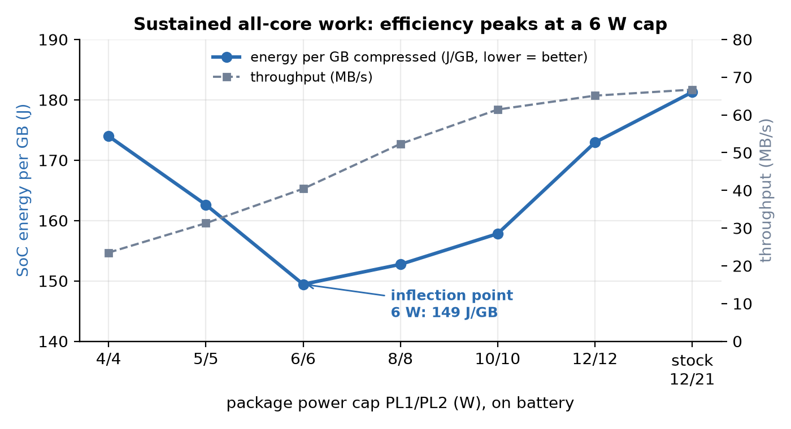
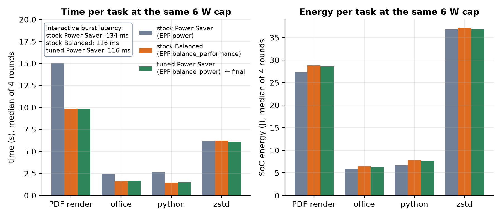
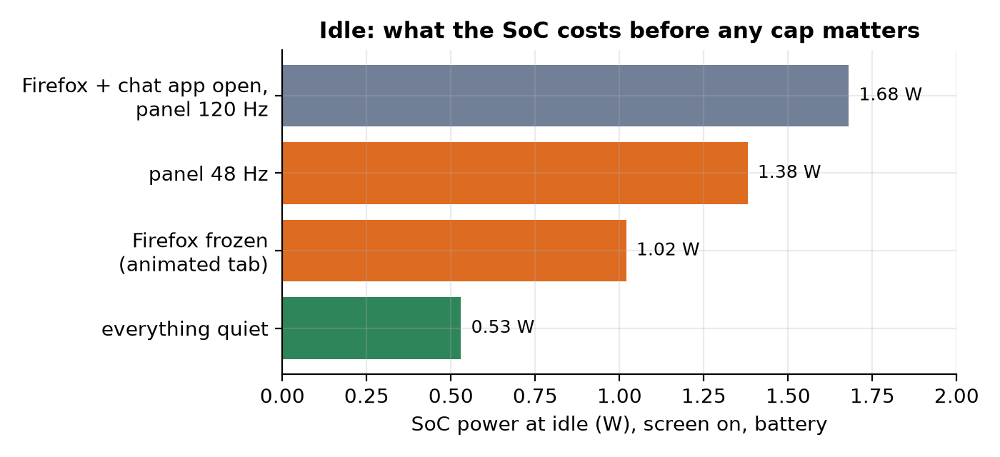
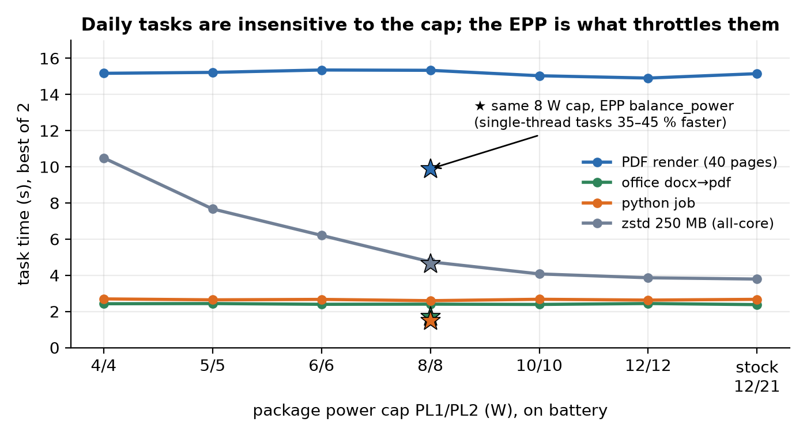
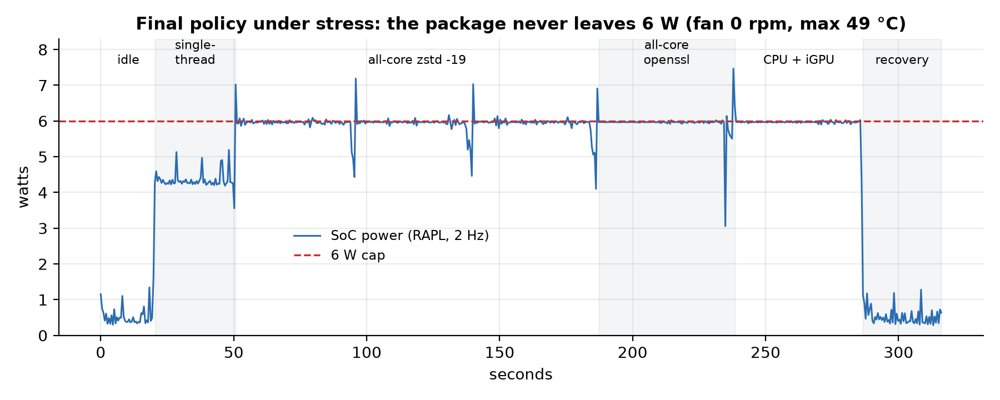

# Finding the power inflection point of a Lunar Lake laptop on Linux

**HP OmniBook X Flip 16 (16-as0xxx), Intel Core Ultra 9 288V "Lunar Lake", Ubuntu 26.04, kernel 7.0.0-31, 2880×1800 120 Hz OLED.**

Aim: find the package power limit at which this chip does the most work per joule, set that as a manual
*battery* profile for use on the go, and compare it against the stock *balanced* and *performance* profiles
(same machine, same tasks, same telemetry). Everything here is measured, scripted and reproducible; the raw
2 Hz power samples for every run are in `results/`.

Companion repo (same laptop): [touchscreen IRQ-routing fix](https://github.com/testyfishy/hp-omnibook-flip16-touchscreen-fix).

## TL;DR — final policy

| | on battery (manual profile) | plugged in | "performance" |
|---|---|---|---|
| power-profiles-daemon profile | power-saver | balanced | performance (manual only) |
| package cap PL1 / PL2 | **6 W / 6 W** | 30 W / 37 W | 30 W / 37 W |
| CPU energy-performance preference (EPP) | **balance_power** (overridden) | balance_performance (ppd default) | performance |
| iGPU ceiling | 1500 MHz | 2050 MHz | 2050 MHz |
| panel refresh | 48 Hz | 120 Hz | 120 Hz |

Why 6 W and why balance_power:

* **Sustained efficiency peaks at 6 W.** Joules per GB of all-core zstd: 174 (4 W) → 163 (5 W) → **149 (6 W)** →
  153 (8 W) → 158 (10 W) → 173 (12 W) → 181 (firmware 12/21). Below 6 W the fixed SoC overhead dominates;
  above it the V/f curve does.
* **The cap barely touches daily use.** PDF rendering, an office conversion and a Python job took the *same*
  time at 4 W as at the stock limits; only all-core compression slows (6.2 s at 6 W vs 3.8 s at 12 W).
* **The energy-performance preference (EPP) matters more than the cap.** Stock Power Saver sets EPP `power`,
  which parks single-thread work at 700–900 MHz. Changing only the EPP to `balance_power` at the same 6 W cap
  (the *tuned Power Saver* below) made single-thread tasks **30–44 % faster** and interactive bursts
  **13–16 % lower latency** for **+1.7 % SoC energy per task-set** and no change at idle (~0.50 W).
* **PL1 = PL2 by design** ("no turbo"): the firmware's PL1 window is 28 s, PL2's is ~1 ms; equal limits make
  the cap effectively instantaneous, and the 6/8 tier showed no benefit from a separate burst budget.
* Under an all-core load with the cap binding, the iGPU is held at its 400 MHz floor (driver throttle reason =
  PL1/PL2). CPU+GPU-heavy use (games) will crawl at 6 W; that is the point of the profile, not a bug.

### The result in two figures





Implementation: `scripts/power-switch.sh` + `scripts/power-switch.conf` (udev rule on the AC adapter, a boot
service and a sleep hook re-apply it; installer `scripts/step13-power.sh`, EPP addition `scripts/step58-power-final.sh`).

## Methodology

### Names used throughout

Three CPU configurations are compared. Each is a GNOME / power-profiles-daemon profile plus what that profile
sets on this machine (the CPU energy-performance preference, EPP, and the HP thermal mode), with the package
power cap held at 6 W for the comparison:

| name in this write-up | profile selected | EPP the CPU runs with | HP thermal mode | in the raw files |
|---|---|---|---|---|
| **stock Power Saver** | power-saver | `power` | quiet | `saver` |
| **stock Balanced** | balanced | `balance_performance` | balanced | `balanced` |
| **tuned Power Saver** (the final battery profile) | power-saver | `balance_power` (overridden after the profile is set) | quiet | `saver+bp` |

EPP is the one knob the profiles really differ by for the CPU: it tells the hardware how eagerly to raise
clocks inside whatever power budget it has. `power` is the most reluctant, `performance` the most eager;
`balance_power` sits one step above `power`. Caps are written as PL1/PL2 in watts (sustained / burst limit;
this work uses equal values so there is no burst budget).

### Measurement choices

These follow the energy-benchmarking literature (references at the end):

* **Energy source.** Intel RAPL package energy (`/sys/class/powercap/intel-rapl:0/energy_uj`) sampled at 2 Hz
  by a bash loop that forks nothing per sample (bash builtins + `read -t` as the timer). RAPL package energy
  correlates ~0.99 with wall power and costs <2 % overhead (Khan et al. 2018). Battery `power_now` on this
  laptop is EC-smoothed over tens of seconds and useless for anything shorter (it read 6.5 W flat through
  every load phase); battery `energy_now` (10 mWh = 36 J steps) is used only for whole-tier drain.
* **Telemetry per sample.** package / core / uncore energy, battery power / energy / voltage, package
  temperature (coretemp), fan RPM (acpi_fan), mean and peak core MHz, iGPU MHz. Phase markers tag every sample
  (tier, phase) so statistics are computed per phase, and only intervals lying entirely inside a phase count
  (no boundary mixing). Rests between runs are excluded.
* **Workloads.** Four daily-use tasks with fixed work (energy-to-completion): 40 pages of PDF rendered with
  pdftoppm, a LibreOffice docx→pdf conversion, a 300 k-record JSON/regex/sort job in Python, and a 250 MB
  `zstd -T0 -12` compression; a **40 s sustained** all-core zstd loop (throughput and J/GB); and for the
  profile comparison a **bursty deadline workload** (20 × fixed single-thread bursts every 0.5 s, latency and
  J per burst) because the racing-vs-pacing-to-idle question only shows up under deadlines.
* **Order and thermal control.** Cap tiers run in *ascending* power order so heat carried over from a hotter
  tier never lands on a cooler one; every tier waits for the package to return to a reference temperature
  (+3 °C) before starting. Profiles are compared **interleaved**: six rounds, each a different permutation of
  the three conditions, so every condition sits in every slot equally and drift cancels. A discarded warm-up
  precedes the measured rounds.
* **Statistics.** Medians with interquartile range; for the profile comparison per-round *paired* differences
  against the baseline with a 10 000-resample bootstrap 95 % CI of the median difference and a win count.
  A difference is reported only when the CI excludes zero.
* **Controls.** Screen blanking and suspend inhibited; brightness, Wi-Fi, background processes and panel refresh
  held constant (the 48 Hz follower is stopped during the profile comparison because it would otherwise change
  with the profile); the cap is re-applied and read back from both RAPL interfaces after every profile switch
  because the HP firmware pins the MMIO PL1 register at 12 W on battery and power-profiles-daemon only writes
  EPP when the profile actually *changes*.

## Results

### 0. Idle baseline (what the SoC costs when nothing happens)

Screen on, battery, power-saver, hands off (`results/00-idle-baseline/`). SoC watts from turbostat, 20 s rows.

| scenario | SoC W | pkg C10 % | IRQ/s | note |
|---|---|---|---|---|
| baseline (Firefox + chat app open, 120 Hz) | 1.68 | 0 | 10 800 | package never reaches deep idle |
| + panel at 48 Hz | 1.38 | 0.2 | 6 900 | −0.30 W from refresh alone |
| + Firefox frozen | 1.02 | 3.4 | 2 200 | Firefox was rendering an animated tab continuously (−0.66 W) |
| everything quiet | **0.51–0.55** | **59–60** | 700–950 | deep package idle is reachable with the screen on |



Overnight suspend (s2idle, 5.5 h): 0.62 W ≈ 0.95 % battery per hour.

### 1. Cap ladder, plugged in (balanced profile, EPP balance_performance)

`results/01-ac-ladder/`. Best-of-2 per task, PL1 = PL2 strict caps, SoC energy per task-set.

| PL1/PL2 (W) | total time (s) | total SoC energy (J) | slowdown | energy | pdf s | office s | python s | zstd s |
|---|---|---|---|---|---|---|---|---|
| default(30/37) | 10.0 | 178 | 1.00x | 1.00x | 5.92 | 0.90 | 0.98 | 2.20 |
| 20(20/20) | 10.4 | 152 | 1.04x | 0.86x | 5.91 | 0.90 | 0.99 | 2.65 |
| 15(15/15) | 11.2 | 143 | 1.12x | 0.81x | 6.05 | 1.00 | 1.02 | 3.12 |
| 12(12/12) | 11.7 | 135 | 1.17x | 0.76x | 6.00 | 0.96 | 1.08 | 3.68 |
| 10(10/10) | 12.8 | 128 | 1.28x | 0.72x | 6.30 | 1.07 | 1.15 | 4.29 |
| 9(9/9) | 13.7 | 124 | 1.37x | 0.70x | 6.44 | 1.10 | 1.21 | 4.99 |
| 8(8/8) | 13.9 | 112 | 1.39x | 0.63x | 6.45 | 1.13 | 1.23 | 5.12 |
| 7(7/7) | 16.9 | 119 | 1.69x | 0.67x | 7.31 | 1.35 | 1.41 | 6.79 |
| 6(6/6) | 20.2 | 123 | 2.02x | 0.69x | 8.18 | 1.44 | 1.62 | 9.00 |
| 5(5/5) | 25.0 | 128 | 2.50x | 0.72x | 9.52 | 1.72 | 1.80 | 11.95 |

Energy per task-set falls all the way down to 8 W (178 J → 112 J, −37 %) for a 1.4× slowdown that is almost
entirely the all-core zstd task; below 7 W the energy curve turns back up. This located the region of interest
(5–8 W) for the battery ladder.

### 2. Cap ladder, on battery (power-saver profile, EPP power) — the inflection point

`results/02-battery-ladder/` (summary, tasks, 2 Hz samples, time series, chart). 13 tiers in ascending order,
cool-down gate before each, 15 s idle + 4 tasks ×2 + 40 s sustained per tier. Fan never spun; package
temperature 39–55 °C.



(Raw 2 Hz power trace of the whole ladder: `results/02-battery-ladder/ladder2-20260918-2258.png`.)

Sustained 40 s all-core zstd (where PL1 vs PL2 shows):

| PL1/PL2 (W) | MB done | MB/s | SoC W mean | median W | p90 W | **SoC J/GB** |
|---|---|---|---|---|---|---|
| 4/4 | 1000 | 23.5 | 3.99 | 3.97 | 3.98 | 174 |
| 5/5 | 1250 | 31.3 | 4.97 | 4.97 | 5.00 | 163 |
| **6/6** | 1750 | 40.4 | 5.90 | 5.96 | 5.98 | **149** |
| 4/8 | 1250 | 30.2 | 4.89 | 3.82 | 7.98 | 166 |
| 5/8 | 1750 | 41.0 | 6.22 | 6.94 | 7.98 | 155 |
| 6/8 | 2250 | 50.3 | 7.40 | 7.97 | 8.24 | 151 |
| 8/8 | 2250 | 52.3 | 7.80 | 7.97 | 8.26 | 153 |
| 8/8 @ balance_power | 2250 | 53.5 | 7.95 | 7.97 | 8.55 | 152 |
| 8/12 | 2500 | 61.8 | 10.21 | 11.81 | 12.12 | 169 |
| 8/15 | 2500 | 61.6 | 10.31 | 11.23 | 13.22 | 171 |
| 10/10 | 2500 | 61.4 | 9.47 | 9.93 | 10.01 | 158 |
| 12/12 | 2750 | 65.1 | 10.99 | 11.96 | 11.99 | 173 |
| firmware (12/21) | 2750 | 66.7 | 11.81 | 12.73 | 13.39 | 181 |

Short daily tasks, best of 2 (time and SoC energy of the 4-task set; ratios vs the firmware tier):

| PL1/PL2 (W) | total s | SoC J | time | energy | pdf s | office s | python s | zstd s |
|---|---|---|---|---|---|---|---|---|
| 4/4 | 30.8 | 83 | 1.28× | 1.00× | 15.2 | 2.4 | 2.7 | 10.5 |
| 5/5 | 28.0 | 79 | 1.17× | 0.94× | 15.2 | 2.4 | 2.6 | 7.7 |
| 6/6 | 26.6 | 76 | 1.11× | 0.91× | 15.4 | 2.4 | 2.7 | 6.2 |
| 4/8 | 24.8 | 76 | 1.04× | 0.91× | 15.3 | 2.4 | 2.6 | 4.5 |
| 6/8 | 24.9 | 78 | 1.04× | 0.93× | 14.9 | 2.4 | 2.7 | 4.8 |
| 8/8 | 25.1 | 77 | 1.05× | 0.92× | 15.3 | 2.4 | 2.6 | 4.7 |
| **8/8 @ balance_power** | **17.7** | 78 | **0.74×** | 0.93× | **9.9** | **1.7** | **1.5** | 4.6 |
| 10/10 | 24.2 | 79 | 1.01× | 0.94× | 15.0 | 2.4 | 2.7 | 4.1 |
| 12/12 | 23.8 | 82 | 0.99× | 0.98× | 14.9 | 2.4 | 2.6 | 3.9 |
| firmware (12/21) | 24.0 | 84 | 1.00× | 1.00× | 15.1 | 2.4 | 2.7 | 3.8 |

Whole-tier view (battery drain from `energy_now`, "rest" = everything that is not the SoC: panel, RAM, Wi-Fi):

| PL1/PL2 (W) | tier s | battery W | SoC W | rest W | idle SoC W | sustained W | pkg T0 → Tmax °C |
|---|---|---|---|---|---|---|---|
| 4/4 | 160 | 5.85 | 2.33 | 3.52 | 0.66 | 3.97 | 39 → 42 |
| 6/6 | 152 | 6.61 | 2.89 | 3.72 | 0.51 | 5.89 | 40 → 45 |
| 8/8 | 149 | 7.49 | 3.51 | 3.98 | 0.65 | 7.79 | 40 → 49 |
| 12/12 | 146 | 8.63 | 4.52 | 4.11 | 0.50 | 11.02 | 40 → 54 |
| firmware (12/21) | 145 | 8.94 | 4.74 | 4.19 | 0.64 | 11.84 | 40 → 55 |

Per-tier / per-phase mean, median, p10, p90, max power for every phase: `results/02-battery-ladder/ladder2-20260918-2258.summary.txt`.

Reading: the **6 W equal cap is the inflection point** for sustained work (best J/GB), the short tasks are
insensitive to the cap, and the one row that broke the pattern (8/8 with EPP `balance_power`, the ★ in the
figure) said that the EPP, not the cap, was throttling single-thread work. That became experiment 3.

### 3. Profile comparison at a fixed 6/6 W cap (interleaved A/B/C)

`results/03-profile-ab/`. The three configurations defined under *Names used throughout*, all at a 6/6 W cap:
stock Power Saver, stock Balanced, tuned Power Saver. Six rounds, six permutations, panel refresh frozen at 48 Hz.


Rounds 2 and 3 of the *stock Power Saver* condition were contaminated (it was requested right after the tuned
condition, the daemon saw "no profile change" and left `balance_power` in place; visible as two fast outliers
in `summary.txt`). The clean analysis below uses rounds 1, 4, 5, 6 (`summary-clean-rounds-1-4-5-6.txt`); the
runner now sets the EPP explicitly for every condition.

Per-condition medians (clean rounds):

| metric | stock Power Saver | stock Balanced | tuned Power Saver |
|---|---|---|---|
| idle SoC W | 0.500 | 0.523 | 0.502 |
| burst latency median / p95 (ms) | 134 / 141 | 116 / 119 | 116 / 118 |
| burst J per burst | 0.470 | 0.482 | 0.477 |
| pdf render s / J | 14.99 / 27.3 | 9.85 / 28.5 | 9.80 / 28.5 |
| office s / J | 2.46 / 5.85 | 1.64 / 6.15 | 1.69 / 6.25 |
| python s / J | 2.65 / 6.70 | 1.48 / 7.80 | 1.49 / 7.75 |
| zstd s / J | 6.18 / 36.8 | 6.21 / 37.1 | 6.13 / 36.8 |
| sustained MB/s · W · J/GB | 40.1 · 5.90 · 150.5 | 40.7 · 5.98 · 150.4 | 40.4 · 5.97 · 151.1 |
| whole-trial SoC Wh | 0.071 | 0.072 | 0.072 |
| trial length s | 96.8 | 89.4 | 89.4 |
| package Tmax °C | 44.5 | 48 | 48 |

Paired differences against stock Power Saver (median of the per-round differences, 95 % bootstrap CI, wins;
* = CI excludes 0):

| metric | stock Balanced − stock Power Saver | tuned Power Saver − stock Power Saver |
|---|---|---|
| burst latency median (ms) | −18.0 [−21.6, −11.6] 4/4 * | −18.9 [−20.7, −14.1] 4/4 * |
| burst latency p95 (ms) | −22.6 [−23.0, −22.1] 4/4 * | −22.9 [−24.6, −22.7] 4/4 * |
| pdf render s | −5.14 (−34 %) 4/4 * | −5.19 (−35 %) 4/4 * |
| office s | −0.83 (−34 %) 4/4 * | −0.75 (−30 %) 4/4 * |
| python s | −1.17 (−44 %) 4/4 * | −1.16 (−44 %) 4/4 * |
| pdf / office / python J | +6 % / +10 % / +16 % * | +5 % / +9 % / +15 % * |
| zstd J | +0.5 % * | +0.4 % (n.s.) |
| sustained MB/s | +1.5 % * | +1.1 % * |
| sustained SoC W | +0.09 * | +0.08 * |
| whole-trial SoC Wh | +2.9 % * | +1.7 % * |
| idle SoC W | n.s. | n.s. |

Verdict: both alternatives buy a third less latency on everything interactive for a couple of percent of
SoC energy under load and nothing at idle. The tuned Power Saver gets the same speed as stock Balanced for
less energy and keeps the quiet fan mode, so it is the one applied.

### 4. Stress verification of the final policy

`results/04-stress-verify/` (console log with per-phase readbacks, turbostat 10 s summaries, samples, chart).
On battery with the final policy active: 20 s idle → 30 s single-thread → 90 s all-core `zstd -19` →
all-core `openssl speed sha256` ×8 → the same plus the iGPU (glxgears, vsync off) → 30 s recovery.



| phase | SoC W mean / median / p99 / max | pkg T | note |
|---|---|---|---|
| idle | 0.50 / 0.42 / – / 1.34 | 32 °C | |
| single-thread | 4.35 / 4.29 / – / 5.19 | 44 °C | fastest core **3100 MHz** |
| all-core zstd −19 (90 s) | 5.93 / 5.96 / 6.91 / 7.19 | 43 °C | one 7.2 W sample |
| all-core openssl ×8 | 5.93 / 5.97 / 6.14 / 7.46 | 47 °C | |
| openssl ×8 + iGPU | 5.97 / 5.97 / 6.03 / 6.43 | 48 °C | iGPU held at 400 MHz floor |
| recovery idle | 0.53 / 0.44 / – / 1.28 | 42 °C | |

Fan 0 rpm throughout, package max 49 °C, zero thermal-throttle events, EPP `balance_power` on all CPUs and
caps 6/6 unchanged at the end. All checks passed.

### 5. Geekbench 6 across the three configurations

Pending — `scripts/step60-geekbench.sh` runs Geekbench 6.7.1 CPU on battery at 6/6 W, then plugged in
(balanced 30/37 W), then in performance mode, with the same telemetry, and `bench-tabulate.py` produces a
table of single/multi-core score, SoC watts, Wh per run, idle watts, temperature, fan, and multi-core score
per SoC watt. Results will be added to `results/05-geekbench/` together with the public Geekbench Browser URLs.

## Reproducing

All scripts are self-contained bash + Python 3 (standard library + Pillow for the charts). They need root for
RAPL energy counters and power caps, and are written for Ubuntu 26.04 with power-profiles-daemon 0.30 and
intel_pstate in active mode; adapt the RAPL / hwmon paths for other machines.

```
sudo bash scripts/step14c-ladder-battery.sh                   # cap ladder on battery (~35 min); TIERS_OVERRIDE="3/3 4/4 …" for other tiers
sudo bash scripts/step14d-epp-ab.sh                           # profile A/B/C at a fixed cap (~25 min); CAP=6/6 ROUNDS=6
sudo bash scripts/step59-stress-verify.sh                     # stress + PASS/FAIL checks of the installed policy (~6 min)
sudo bash scripts/step60-geekbench.sh                         # Geekbench across battery/AC/performance (needs bench/Geekbench-6.7.1-Linux)
python3 scripts/ladder-analyze.py results/02-battery-ladder/ladder2-20260918-2258     # re-analyse any run
python3 scripts/ab-analyze.py results/03-profile-ab/ab-20260918-2356
python3 scripts/make-figures.py                               # regenerate results/figures/ (needs matplotlib)
```

Optional `PDF=/path/to/some.pdf` gives the render task a real document (the published runs used a 4.4 MB,
40-page journal PDF with figures; without it the scripts render the generated sample document, which is lighter).

To install the policy on a similar machine: `sudo bash scripts/step13-power.sh` (udev rule, boot service,
sleep hook, config), then `sudo bash scripts/step58-power-final.sh` (6/6 W + EPP override). Rollback scripts
are included. Note that choosing a profile by hand in GNOME quick settings lets the daemon rewrite the EPP
until the next adapter event, boot or resume.

## Caveats

* One laptop, one firmware (BIOS F.10). The HP firmware pins one PL1 register at 12 W on battery; the caps
  were verified through the RAPL MSR interface and, more importantly, through the measured power.
* The 6 W figure is this chip's inflection point for *this* sustained workload (zstd). The short tasks were
  cap-insensitive from 4 W upward, so a different sustained workload could move the optimum by a watt.
* Battery `power_now` on this EC is not usable for sub-minute measurements; whole-laptop numbers come from
  `energy_now` over ≥2-minute tiers and carry a 36 J quantisation.
* Wine-based Cinebench was not run (no Linux build; results would be neither comparable nor submittable).

## References

* K. N. Khan, M. Hirki, T. Niemi, J. K. Nurminen, Z. Ou, *RAPL in Action: Experiences in Using RAPL for Power Measurements*, ACM TOMPECS 3(2), 2018. https://doi.org/10.1145/3177754
* H. Hoffmann et al., *Racing and Pacing to Idle: Minimizing Energy Under Performance Constraints*, U. Chicago TR-2014-10. https://newtraell.cs.uchicago.edu/files/tr_authentic/TR-2014-10.pdf
* *Systematic Detection of Energy Regression and Corresponding Code Patterns in Java Projects* (randomised order, warm-up, thermal gate, repeated trials, medians), arXiv:2604.19373.
* *What Is the Cost of Energy Monitoring? An Empirical Study on the Overhead of RAPL-Based Tools*, arXiv:2604.26815.
* power-profiles-daemon README (profile → platform_profile + EPP mapping). https://gitlab.freedesktop.org/upower/power-profiles-daemon
* Linux kernel documentation, *Intel Performance and Energy Bias Hint* and *intel_pstate*. https://www.kernel.org/doc/html/latest/admin-guide/pm/

## License

MIT (scripts and write-up). Measurement data in `results/` may be reused freely with attribution.
